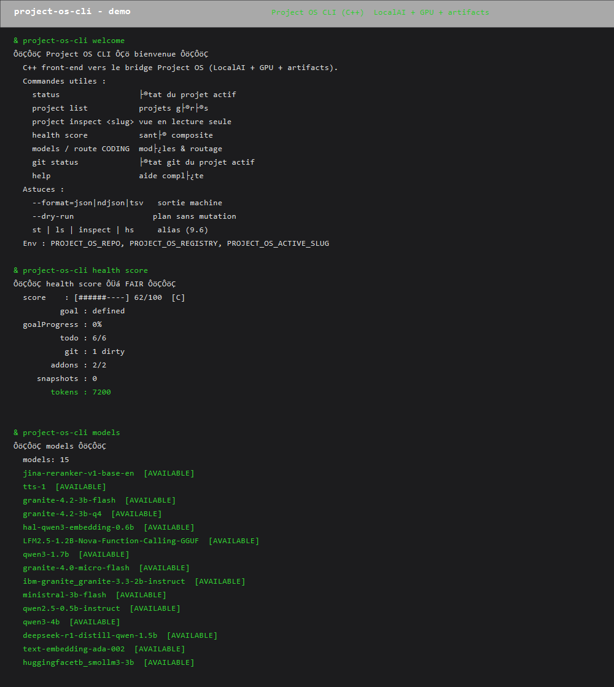

# Cline Project OS

<p align="center">
  
  
  
  
  
  
  
  
  
  
  
  
</p>

## 🚀 Project OS — pilotez vos agents & projets en local

**Project OS** branche un **Control Center + Artifact System** autour du **vrai SDK Cline** (`@cline/sdk`),
et fournit un **CLI C++ puissant** (`cli-cpp/`) qui pilote tout **sans l'IDE** — via le bridge Node (protocole v2).
Greenfield, **autonome**, **open-source** (Apache-2.0).

> **Le CLI délègue toute logique métier au bridge** — jamais de ré-implémentation. `CreateProcessW`, **no shell**.

<p align="center">
  
</p>

### ⚡ Quick start
```powershell
# Clone + build le CLI (MinGW + CMake requis)
git clone https://github.com/regardlent/projet-os.git && cd projet-os
cmake -S cli-cpp -B cli-cpp/cmake-build && cmake --build cli-cpp/cmake-build

# Ou installation 1-liner
powershell -ExecutionPolicy Bypass -File scripts\install.ps1

project-os-cli welcome
project-os-cli health score
project-os-cli cockpit --watch=2
project-os-cli --format=json status
```

### ✨ Fonctionnalités clés
- **Extension VS Code** : Control Center sécurisé (webview CSP + nonce), Artifact System (state machine + versions + review), ProjectDNA, vues Projects/Artifacts.
- **CLI C++** : menus ou scriptable ; `--format=json|ndjson|tsv`, `--color`, `--theme`, `--timeout`, `--explain/--dry-run`, `--trace`, `--silent/--check`, `--json`, `--time`, `--width`.
- **Intelligence & analyse (10 features)** : `health score|trend|compare`, `budget forecast`, `insights tokens`, `diagnose`, `drift alert|compare`, `goal traction|cost`, `autonomy health`, `risk profile`.
- **Runtime réel** : LocalAI loopback, GPU (`nvidia-smi`), models, route, endurance, report, release gate, export sarif, test matrix.

### 🧩 Pourquoi Project OS ?
| | |
|---|---|
| 🖥️ **Sans l'IDE** | CLI complet : cockpit, git, artefacts, MCP, santé, modèles, GPU. |
| 🔒 **Sécurisé** | No shell, secrets redigés, `--trace` sur stderr, `/bridge audit`, sanitizers ASan/UBSan. |
| ⚙️ **Testé** | typecheck 0 erreur · `ctest` 100% · soak 100/100 · fuzz/property · golden. |
| 🧩 **Extensible** | alias & commandes custom (`custom add`), config file, complétion dynamique. |
| 📦 **Scriptable** | `--format=json\|ndjson\|tsv` + exit codes (F03), conjugable en CI. |

### 🛠 Stack
C++17 (CLI, MinGW/CMake) · TypeScript (extension + bridge Node) · `@cline/sdk` · MCP SDK ·
LocalAI · VS Code ≥1.90.

### ⭐ Soutenez le projet
Une étoile aide énormément à la visibilité. Vos **issues**, **PR** et **contributions** sont bienvenus :
[CONTRIBUTING](.github/CONTRIBUTING.md) · [Code de conduite](.github/CODE_OF_CONDUCT.md) ·
[Sécurité](.github/SECURITY.md) · [Feuille de route](docs/CLI_ROADMAP_50X50.md).

> ⚠️ État : **CLI C++ 10 phases complétées (90/100 étapes)**. Typecheck **0 erreur**, cpp `ctest` **100% pass**,
> `pos_json_test` **ALL PASS**, node **368/369** (1 échec = test antigravity environnemental du host, pré-existant).
> Le CLI pilote le bridge Project OS (LocalAI loopback, GPU `nvidia-smi`, models, route, artifacts, git, cockpit,
> intelligence & analyse) ; l'extension host et Antigravity restent **UNVERIFIED** sauf détection réelle.
> `release` → Release Center (version + feature matrix), `release bump <v>`, `release changelog`. Workspace canonique : `C:\Users\eiden\Desktop\dev\projet-os`.

## Prérequis

- Node 20+ (testé sur Node 24)
- VS Code ≥ 1.90

## Développement

```bash
cd project-os
npm install
npm run compile      # tsc -> dist/
npm run typecheck    # tsc --noEmit
npm test             # compile + node --test "dist/tests/*.test.js"
```

Pour lancer : ouvrir le dossier `project-os/` dans VS Code et F5 (extension host) —
un Launch config `Debug: Extension` est attendu (voir `.vscode/`).

## Getting Started (CLI C++)

Le **CLI C++** (`cli-cpp/`) pilote Project OS sans l'IDE : il délègue toute la logique au bridge
(`bin/project-os-bridge.mjs`, protocole v2) via `CreateProcessW` (pas de shell).

### 1. Build

```powershell
# MinGW + CMake requis (C:\msys64\mingw64\bin sur PATH)
cmake -S cli-cpp -B cli-cpp/cmake-build
cmake --build cli-cpp/cmake-build          # -> cli-cpp/cmake-build/project-os-cli.exe
```

### 2. Install (optionnel)

```powershell
# Build + copie dans ~\.project-os\bin + ajout PATH + completion PowerShell
powershell -ExecutionPolicy Bypass -File scripts\install.ps1
# Mise à jour : scripts\update.ps1   |   Signature : scripts\sign.ps1 (si cert)
```

### 3. Variables d'environnement

| Variable | Rôle |
|---|---|
| `PROJECT_OS_REPO` | repo racine (défaut : `C:\Users\<you>\Desktop\dev\projet-os`) |
| `PROJECT_OS_REGISTRY` | chemin du registre hub (`...\.hub-managed.json`) |
| `PROJECT_OS_ACTIVE_SLUG` | slug du projet actif |
| `PROJECT_OS_DAILY_BUDGET` | budget quotidien (alerte `usage summary`) |
| `PROJECT_OS_PAID_MODE` | politique PAYG (`free`/`pass`/`payg`) |

### 4. Exemples

```powershell
project-os-cli --format=json status        # état JSON du projet actif
project-os-cli project list                # projets gérés
project-os-cli health score                # santé composite (score + grade + signal)
project-os-cli models                      # modèles LocalAI
project-os-cli route CODING --alt          # routage adaptatif + alternatives
project-os-cli cockpit --watch=2           # dashboard live
project-os-cli git status                  # git du projet actif
project-os-cli release                     # Release Center (version + feature matrix)
project-os-cli welcome                     # guide rapide
project-os-cli st                          # alias -> status   (ls/…/hs/qx/cfg)
project-os-cli create demo --dry-run       # plan sans mutation (NO MUTATION)
project-os-cli --trace status              # requestId sur stderr
```

- **Formats machine** : `--format=json|ndjson|tsv` · **Couleur** : `--color=auto|always|never`, `--theme=light|dark`, `--mono`
- **Aide** : `--help` catégorisé · **Tests** : `ctest --test-dir cli-cpp/cmake-build` (100% pass) · `npm run typecheck` (0 erreur).
- **Installation de la completion** : `project-os-cli completion powershell|bash|zsh [--slugs]`.

## Architecture

```
ClineCore (@cline/sdk)  ──>  ClineRuntimeAdapter  ──>  RuntimeEventNormalizer
                                                                  ↓
                                        ProjectEvent (événements internes stabilisés)
                                                                  ↓
                                          ArtifactRegistry + ArtifactStore (persistance)
                                                                  ↓
                                      ArtifactsTreeProvider + ControlCenter (webview sécurisé)
```

- `ClineRuntimeAdapter` : seule chose qui importe `@cline/sdk` à l'exécution.
- `PermissionsAdapter` : politiques d'outils réelles (lecture auto-approvée ; écriture => approbation ;
  deploy/push => désactivé).
- `ArtifactRegistry` + `ArtifactStore` : state machine, versions, commentaires, review,
  persistance atomique, tolérance aux index corrompus.
- `ProjectDNA` : scan en lecture seule du stack.

## Sécurité

- Webview : CSP stricte + nonce + validation des messages.
- Outils sensibles : jamais auto-approuvés sans politique explicite.
- Pas de télémétrie externe, pas de publication automatique, pas de secret.

## Tests

- Machine à états des artifacts.
- Normalisation des événements Cline (`chunk`, `hook`, `ended`, `status`, …).
- Politiques de permissions.
- Registre + persistance + récupération de corruption.

## CLI C++ (cli-cpp)

En complément de l'extension, un **CLI C++/CMake** (`cli-cpp/`) pilote Project OS par menus ou en
mode scriptable via la passerelle Node (`bin/project-os-bridge.mjs`). Voir `cli-cpp/README.md`.

- Surface : `help`, `version`, `status`, `project list|use|inspect|watch`, `drift`, `timeline`,
  `snapshot`, `diff`, `goal proof`, `todo board`, `artifact *`, `addon verify`, `config`, `doctor`,
  `diagnostics`, `preflight`, `models`, `model *`, `route`, `gpu`, `test list|matrix`, `report`,
  `release gate`, `export sarif`, `cockpit`, `completion`, `bridge status|start|stop|…`.
- **Intelligence & analyse (10 features, phase 27+)** : `health score`, `health trend`,
  `health compare <a> [b]`, `budget forecast`, `insights tokens`, `diagnose`, `drift alert`,
  `goal traction`, `autonomy health`, `risk profile`. Bus d'analyse déterministe (read-only),
  sortie `human|json|ndjson|tsv`, dégradation propre si git/LocalAI/GPU indisponibles.
- `--format=json|ndjson|tsv`, `--color=auto|always|never`, `--timeout=<ms>`, `--explain/--dry-run`.

## Documentation

- [Guide « rendre le dépôt populaire »](docs/GITHUB_POPULARITY.md) — SEO, topics, community health files, workflow d'abonnements.
- [Feuille de route 50×50 (2500 étapes)](docs/CLI_ROADMAP_50X50.md) — plan de la prochaine génération du CLI.
- **`cli-cpp/README.md`** — CLI C++ : build (CMake), menu interactif, mode scriptable, codes de sortie, Intelligence & analyse.
- **`docs/PROJECT_OS_CLI_V3_REFERENCE.md`** — référence CLI v3 (architecture, 50 features + IA01-IA10, limitations honnêtes).
- **`docs/SLASH_COMMANDS.md`** — commandes slash `/goal`, `/create`, `/addon`, `/autonomy`, `/docs`.
- **`artifacts/cli-v3/`** — pack d'évidence CLI (feature matrix, release gate/report, security, soak, research).

## Contribuer

Merci de lire [CONTRIBUTING.md](.github/CONTRIBUTING.md), [CODE_OF_CONDUCT.md](.github/CODE_OF_CONDUCT.md)
et [SECURITY.md](.github/SECURITY.md) avant d'ouvrir une issue ou une PR (templates prêts dans `.github/`).
Commits conventionnels (`feat:` / `fix:` / `docs:`…), validation par `npm run typecheck`, `npm test`,
`ctest` et `soak`.

## Exemples d'utilisation (CLI)
```bash
# Projet actif
project-os-cli status                  # résumé du projet actif (── status ──)
project-os-cli health score            # score composite + barre + grade + couleur
project-os-cli diagnose                # diagnostic classé (CLEAR/WARN/ALERT, exit 1 si issues)
project-os-cli drift alert             # divergence vs baseline snapshot
project-os-cli goal traction           # traction du goal (progress + todo + critères)
project-os-cli risk profile            # risques consolidés + mitigations

# Formats machine (stdout = data, stderr = diagnostics)
project-os-cli health score --format=json
project-os-cli risk profile --format=ndjson
project-os-cli diagnose --format=tsv
```

## Roadmap (non implémenté)

Multi-agent/teams, MCP, Task/Testing API, Git/worktree/checkpoints, Release Center,
Accessibilité/E2E Antigravity.
